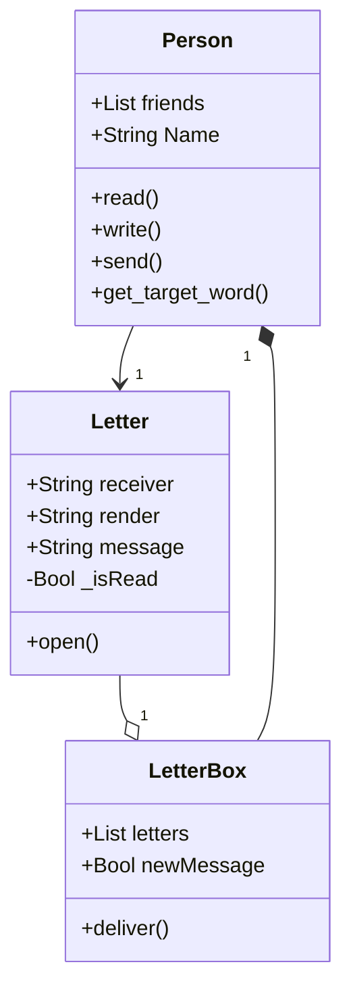

```mermaid

classDiagram
    class Person{
        +List friends
        +String Name
        +read()
        +write()
        +send()
        +get_target_word()
    }

    class LetterBox{      
        +List letters  
        +Bool newMessage
        +deliver()
    }

    class Letter{
        +String receiver
        +String render
        +String message
        -Bool _isRead
        +open()
    }

    Person --> "1" Letter
    Letter --o "1" LetterBox
    LetterBox --* "1" Person


```