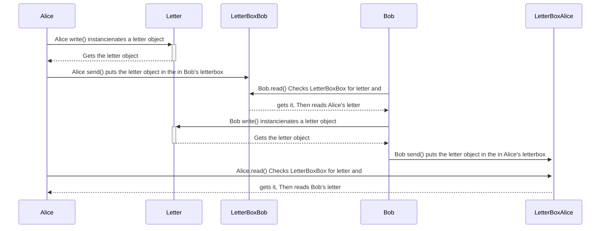

```mermaid
sequenceDiagram
    Alice->>+Letter: Alice write() instancienates a letter object
    Letter-->>-Alice: Gets the letter object
    Alice->>LetterBoxBob: Alice send() puts the letter object in the in Bob's letterbox
    Bob->>LetterBoxBob: Bob.read() Checks LetterBoxBox for letter and
    LetterBoxBob-->>Bob: gets it, Then reads Alice's letter
    Bob->>+Letter: Bob write() instancienates a letter object
    Letter-->>-Bob: Gets the letter object
    Bob->>+LetterBoxAlice: Bob send() puts the letter object in the in Alice's letterbox
    Alice->>LetterBoxAlice: Alice.read() Checks LetterBoxBox for letter and
    LetterBoxAlice-->>Alice: gets it, Then reads Bob's letter
```