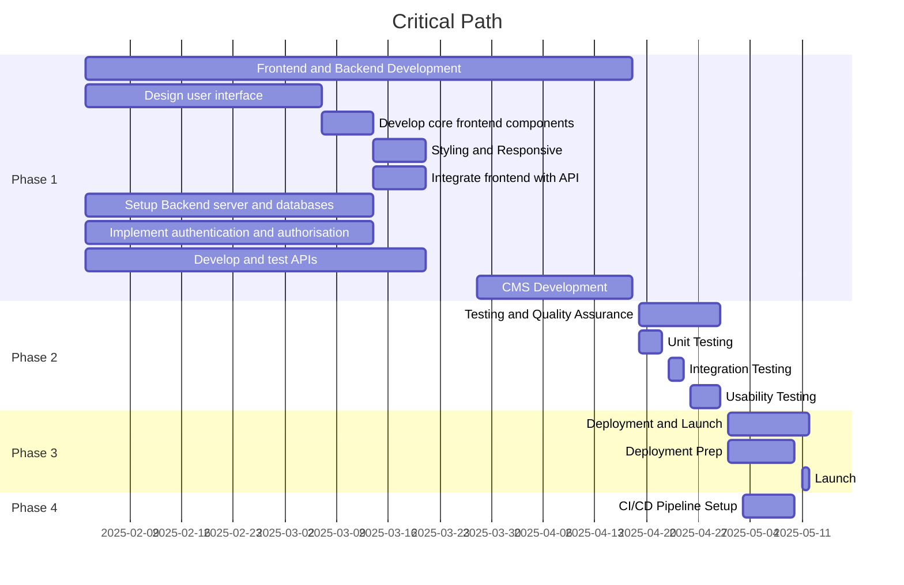

```mermaid

gantt
    title Critical Path
    dateFormat YYYY-MM-DD
    section Phase 1
        Frontend and Backend Development :p11, 2025-02-03, 2025-04-18
        Design user interface :p12, 2025-02-03, 2025-03-07
        Develop core frontend components :p13, 2025-03-07, 2025-03-14
        Styling and Responsive :p14, 2025-03-14, 2025-03-21
        Integrate frontend with API :p15, 2025-03-14, 2025-03-21
        Setup Backend server and databases :p16, 2025-02-03, 2025-03-14
        Implement authentication and authorisation :p17, 2025-02-03, 2025-03-14
        Develop and test APIs :p18, 2025-02-03, 2025-03-21
        CMS Development :p18, 2025-03-28, 2025-04-18
    section Phase 2
        Testing and Quality Assurance :p21, 2025-04-19, 2025-04-30
        Unit Testing :p22, 2025-04-19, 2025-04-22
        Integration Testing :p23, 2025-04-23, 2025-04-25
        Usability Testing :p24, 2025-04-26, 2025-04-30
    section Phase 3
        Deployment and Launch :p31, 2025-05-01, 2025-05-12
        Deployment Prep :p32, 2025-05-01, 2025-05-10
        Launch :p33, 2025-05-11, 2025-05-12
    section Phase 4
        CI/CD Pipeline Setup :p41, 2025-05-03, 2025-05-10

```