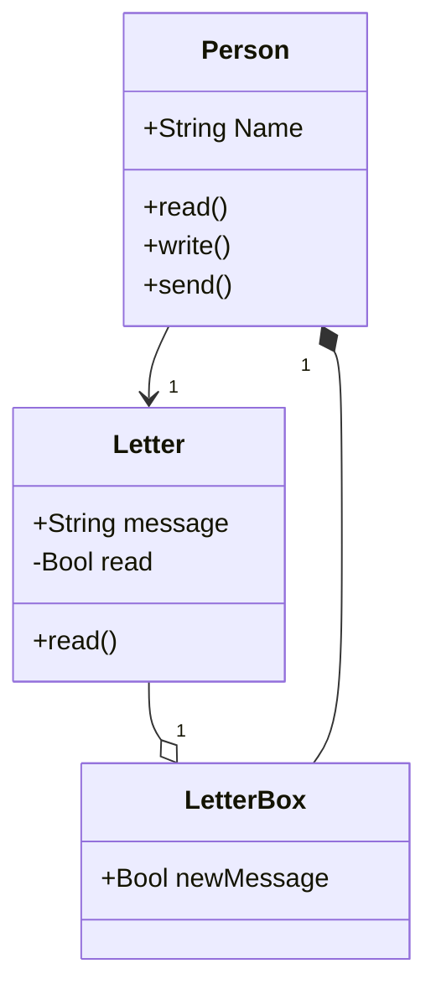

```mermaid

classDiagram
    class Person{
        +String Name
        +read()
        +write()
        +send()
    }

    class LetterBox{        
        +Bool newMessage
    }

    class Letter{
        +String message
        -Bool read
        +read()
    }

    Person --> "1" Letter
    Letter --o "1" LetterBox
    LetterBox --* "1" Person

```