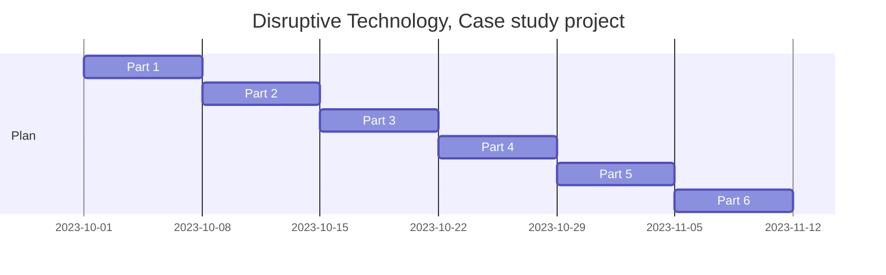

## kba
## q1
What are three sources of information on emerging technologies and practices in the IT industry?

 I get most of my information on emerging technologies for podcast and blogs with a technology focus. Other ways are news media, technology news media and social media.

## q2
How can you Identify and document emerging technologies and practices relevant to organisational context?

 You Identify emerging technologies by understanding you domain well so when you see something on where ever you get your information on emerging technologies. Also listening to other worker in your domain. 

 To document there should be an agreed format to add to a centralised shared document like a wiki.

## q3
what are ways you can evaluate features and functions of emerging technologies and practices to determine advantages and disadvantages relevant to organisational contexts?

 Listen to the experience of others but only if you evaluate them as authentic knowledge. Use critical thinking techniques like Gap Analysis SWOT, Balanced Scorecard, Cost-Benefit Analysis and Feature Comparison Matrix

## q4
How could you seek and obtain feedback from organisational representative on assessment of impact of emerging technologies and practices and incorporate feedback into reports?

 There can be self reporting, this can have problem of not being accurate also having measurable but you must be careful because if people work to the measurable it will distort the outcome.

 incorporating feedback into reports is very important because without getting the feedback and understanding it you can't improve. 

## q5
What are some examples of protocols for virtual team working, including cyber safety protocols?
 
 Let your tools do the heavy lifting. Have strong passwords, use password managers. Use encryption of files at rest, make sure you file shearing solution has it. Encryption in transit, this is mostly covered by default.

## q6
What are the best ways to determine roles and responsibilities of team members when working as a team?

 Determine what is needed for the project, what skills people have and how best to match to what is needed. Then best supporting anywhere there is weakness also just do the best with what you have.

## q7
What are some Cyber security considerations that need to be noted when developing protocols for using collaborative technologies?

 People are usually your weakest link with cyber security. Make it as easy as possible to do the right thing regarding cyber security, have your tools do the heavy lifting. If there is a onerous protocol make sure it is effective, unlike changing passwords regularly which lowers security.

## 8
What are some ways in which you can review the protocols set up to work collaboratively in a virtual environment?

 Read the policy and procedure document, ask other members of the team. 

## 9
What are examples of legislation, codes, regulations and standards, and work health and safety requirements for collaborative work arrangements?
 
 https://www.northmetrotafe.wa.edu.au/student-code-conduct

There is a staff code of conduct as well but could get an external link.
even though these are for other purposes they can apply to anywhere people are working together.

## 10
Identify key characteristics of concepts in a critical thinking protocol or process

 Perception, because details matter. methodical, any changes come from the subject not the process of analysing it. Feedback, it is the only way you can find out what you are thinking translates into reality.

## 11
Outline the benefits of adopting a critical thinking mindset and the risks associated with failing to do so

 Critical thinking is part of due diligent, it increases the likely hood of make right choices, if you don't it is more about luck.

## 12
Identify two situations in which critical thinking concepts may be applied in the workplace

 When deciding on projects, their merits and wether to proceed.
 
 Talking with co workers. Sometimes they know what they are talking about, sometimes the don't and are really sure of them self and sometimes they do and are really unsure of them self. It is important to know the difference and critical thinking can help.

## 13
Compare two alternative critical thinking concepts in a workplace decision making process

 Rational decision-making
 Is a systematic, analytical way of making decisions. You define the problem, generate solutions, evaluate the solutions and pick the best one. It can result is good out comes but is slow.

 Bounded rationality
 This is a time constrained version of rational decision-making. As much information is gathered as possible but the heavy lifting is done by the persons experience and the decision is made from the gut through intuition.
 
## 14
Why is reviewing the effectiveness of decision making and seeking meaningful feedback from organsational management?

 I feel important is missing from this question.
 Without review or feedback you can't tell what is working and you should be doing more and what is not working and you should not be doing at all. All business are build on feedback if you think about it profit is a form of feedback.

## 15
What ways can you identify areas for self-development?

 I am not good at doing the work, I don't have good academic cardio. I had hoped to improved this over the semester but I haven't really seen any changes, maybe if I was measuring better and not just my subjectivity I could have a better idea on what and how to improve this.

# eight
 Effective Presentation

# seven
sidle 4
bottom-up estimating
This approach involves breaking down the project into smaller tasks and estimating the cost of each task. The cost of each task is then rolled up to determine the total cost of the project.

slide 5
top-down estimating
estimating the overall cost of the project based on historical data or expert judgment. The estimate is then broken down into smaller components.

slide 7
analogous estimating
Using similar projects as ta basis for estimating the cost fo the current project. The cost of the previous project is adjusted for differences in scope, scale, and complexity to arrive at an estimate for the current project.

slide 9 
three-point estimating
estimating the most likely, optimistic, and pessimistic scenarios for the project. The estimates are then averaged to arrive at a final estimate.

slide 11
Deliverables
is a tangible or intangible item that is produced as a result of a project and is required to be delivered to the project stakeholders. Deliverables are specific, measurable and verifiable, and are used to determine whether the project has been successfully completed.

slide 12, 13
Identify deliverables
Define the project scope: Identify the project objectives and goals, and define the boundaries od the project.
Break down the project into tasks: Identify all the tsks required to complete the project and group them into phases.
Identify the outputs of each task: For each task, identify what the expected outputs or results are.
Identify the final deliverables: Identify the deliverables that will be produced at the end of each phase or at the end of the project.
Verify the deliverables: Ensure that each deliverable is specific, measurable and verifiable and that it meets the requirements of the stakeholders.

slide 15
project management methodologies
waterfall
Sequential and linear process: The Waterfall methodology follows a sequential and linear process, with each phase completed before moving on to the next one.
Emphasis on planning: Waterfall relies heavily on upfront planning, with a detailed project plan and requirements document created at the start of the project.
Emphasis on documentation: Waterfall places a high emphasis on documentation, with detailed requirements, design, and testing documentation produced at each stage of the project.
Limited scope for change: The Waterfall process is less flexible and allows for limited changes once the project plan has been established.

slide 16
agile
Iterative and incremental process: Agile follows an iterative and incremental process, with work broken down into short cycles or sprints.
Emphasis on flexibility: Agile emphasizes adaptability and the ability to respond to change, with changes in requirements and priorities accommodated during the project.
Emphasis on collaboration: Agile encourages collaboration between team members, with an emphasis on communication and frequent feedback.
Limited documentation: Agile places less emphasis on documentation, with a focus on working software over documentation.

slide 17
A project timeline is a visual representation of the schedule or plan for a project. It shows the start and end dates for each task, milestone, and deliverable, as well as the dependencies between them. A project timeline helps project teams to visualise and communicate the sequence of activities and the time frame required to complete the project.

slide 18
A project timeline typically includes the following information:

Task descriptions: A list of tasks required to complete the project, along with a brief description of each task.
Start and end dates: The dates on which each task is scheduled to begin and end.
Milestones: Key events or deliverables that mark important stages of the project.
Dependencies: Relationships between tasks, indicating which tasks must be completed before others can start.
Resources: The people, equipment, and materials required to complete each task.
Duration: The estimated time required to complete each task.

slide 21
A Gantt chart is a popular project management tool that provides a graphical representation of a project schedule. The chart displays the project activities or tasks on the horizontal axis and the timeline on the vertical axis. Each task is represented by a horizontal bar that shows its start date, end date, and duration. The bars are arranged in chronological order, showing the order in which the tasks will be completed.

Gantt charts are used to visualize project schedules, identify the critical path and dependencies between tasks, and track progress against the project timeline. They can also be used to communicate the project schedule to stakeholders, including team members, managers, and clients.

slide 22
Key features of a Gantt chart include:

Task list: A list of all the tasks required to complete the project.
Timeline: A timeline showing the duration of the project.
Bar chart: Horizontal bars that represent the duration of each task.
Milestones: Key events or deliverables that mark important stages of the project.
Dependencies: Arrows or lines that indicate the dependencies between tasks.
Resources: The people, equipment, and materials required to complete each task.

slide 23
Using MSProject, create a Gantt Chart for your ongoing Disruptive Technology Project.

https://support.microsoft.com/en-us/office/basic-tasks-in-project-8fdbf020-a9e1-45e4-bf15-23a8d2b6797d 

https://www.upanup.com/news/website-timeline-plan-success 

# six

# five

 Gap Analysis
A gap analysis is a strategic planning tool that is used to identify the difference between an organization's current performance and its desired performance, and to develop a plan to bridge the gap. The purpose of a gap analysis is to identify areas where an organization is falling short of its goals, and to develop a roadmap for improvement.

 SWOT
SWOT is an acronym that stands for Strengths, Weaknesses, Opportunities, and Threats. It is a strategic planning tool used by businesses, organizations, and individuals to assess their current situation and identify areas for improvement.

The SWOT analysis involves analyzing both internal and external factors. The strengths and weaknesses refer to internal factors that are under the control of the organization or individual, such as resources, skills, and capabilities. The opportunities and threats refer to external factors that are beyond the control of the organization or individual, such as economic trends, competition, and regulatory changes.

The SWOT analysis is often used in business to help organizations identify their competitive advantages and disadvantages, as well as potential growth opportunities and risks. It can also be used in personal development to identify areas for improvement and potential career opportunities.

 Balanced Scorecard
This tool is used to measure an organization's performance and align it with its strategic objectives. It considers four key perspectives: financial, customer, internal processes, and learning and growth.

 Cost-Benefit Analysis
A cost-benefit analysis (CBA) is a decision-making tool that compares the costs of a project or action with the benefits that it is expected to produce. The goal of a CBA is to determine whether the benefits of a project or action outweigh its costs, and to identify the most cost-effective solution.

 Feature Comparison Matrix
A Feature Comparison Matrix is a tool used to compare and evaluate multiple products or services based on their features, benefits, and specifications. The purpose of a Feature Comparison Matrix is to provide a side-by-side comparison of different products or services, which can help users make informed decisions based on their needs and preferences.
## links
slide 8
https://the-happy-manager.com/article/rational-decision-making-model/
Bounded rationality model slide 9
https://boycewire.com/bounded-rationality-definition/
Behavioral slide 10
https://www.yourarticlelibrary.com/management/decision-making-management/decision-making-models-rational-and-behaviour-model/53213
Incremental slide 11
https://rebelsguidetopm.com/incremental-model-of-decision-making/
Intuitive slide 12
https://www.decision-making-solutions.com/intuitive_decision_making.html
Participatory slide 13
https://evalcareers.com/magazine/what-is-participatory-decision-making/
swot decision making tool slide 24
https://www.investopedia.com/terms/s/swot.asp

# Four session

## links
critical thinking slide 7
https://www.monash.edu/student-academic-success/enhance-your-thinking/critical-thinking/what-is-critical-thinking

Brain storming, mindmap slide 12
https://www.monash.edu/learnhq/enhance-your-thinking/brainstorm-and-mind-map

https://en.wikipedia.org/wiki/List_of_concept-_and_mind-mapping_software

http://www.mindmup.com/
http://www.mindmeister.com/
http://freemind.sourceforge.net/wiki/index.php/Main_Page

https://www.monash.edu/student-academic-success/enhance-your-thinking/critical-thinking/evaluate-arguments-of-others/errors-in-argumentation-bias-and-poor-reasoning

# Three session

## links
### from power point.
privacy slide 7 
https://www.ag.gov.au/rights-and-protections/privacy 
https://www.oaic.gov.au/ 

intellectual property slide 11
https://www.infrastructure.gov.au/media-communications-arts/copyright/copyright-basics
https://www.ag.gov.au/rights-and-protections/copyright/copyright-basics 

Accessibility slide 15
https://humanrights.gov.au/our-work/employers/disability-discrimination

cybersecurity slide 19
https://www.cyber.gov.au/ 
https://www.cyber.gov.au/acsc/view-all-content/advice/using-information-security-manual

# group - Deep learning

Purpose
To have computers do things that people do innately to large data sets. 
computer vision https://en.wikipedia.org/wiki/Computer_vision
acquiring, processing, analysing and understanding digital images.
speech recognition https://en.wikipedia.org/wiki/Speech_recognition
enable the recognition and translation of spoken language into text by computers.
natural language processing https://en.wikipedia.org/wiki/Natural_language_processing
processing text corpora or speech corpora to have computer capable of "understanding" the contextual nuances and extract information and insights.
machine transition https://en.wikipedia.org/wiki/Machine_translation

bio informatics https://en.wikipedia.org/wiki/Bioinformatics
drug design
medical image analysis
climate science
board games

https://en.wikipedia.org/wiki/Deep_learning

- part of a broader family of machine learning methods.
- based on artificial neural networks
- deep refers to multiple layers through the data is transformed. Methods to transform can be either supervised, semi-supervised and unsupervised.

## significant attributes
### multiple layers. First is simplest, each builds on top of the last.
- Deep neural network is an artificial neural network with multiple layers between input and outputs
- The extra layers enable composition of features from lower layers, potentially modeling complex data with fewer units than similarly performing shallow network.
- Can model complex non-linear relationships.

- Artificial neutral networks (ANN) tend to be static and symbolic.

DNNs are typically feedforward networks in which data flows from the input layer to the output layer without looping back. At first, the DNN creates a map of virtual neurons and assigns random numerical values, or "weights", to connections between them. The weights and inputs are multiplied and return an output between 0 and 1. If the network did not accurately recognize a particular pattern, an algorithm would adjust the weights.[140] That way the algorithm can make certain parameters more influential, until it determines the correct mathematical manipulation to fully process the data.

significant attributes​

    Can model complex non-linear relationships by emulating a human brain.​

    Deep neural network is an artificial neural network with multiple layers between input and outputs.​

    The extra layers enable composition of features from lower layers, potentially modeling complex data with fewer units than similarly performing shallow network.​

    They are typically feedforward networks in which data flows from the input layer to the output layer without looping back.​

edge://flags/#enable-force-dark