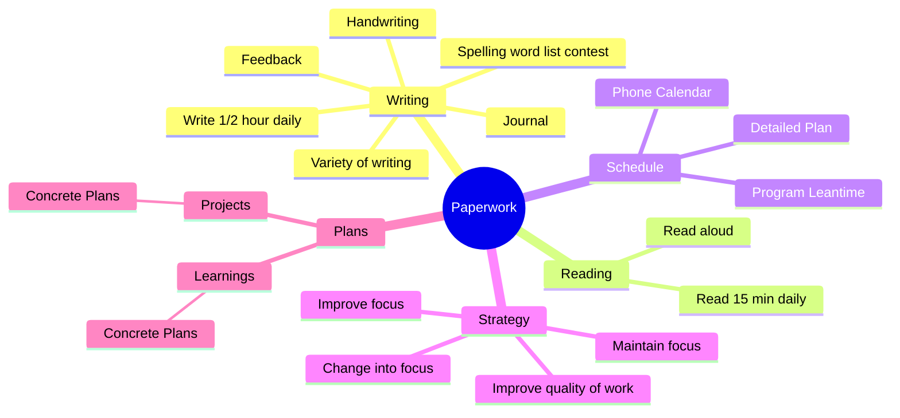

What
Why
How
Who
When
Where

```mermaid
mindmap
  root((Paperwork))
    Writing
      Write 1/2 hour daily
      Journal
      Spelling word list contest
      Variety of writing
      Feedback
      Handwriting
    Reading
      Read 15 min daily
      Read aloud
    Schedule
      Phone Calendar
      Detailed Plan
      Program Leantime
    Strategy
      Improve quality of work
      Improve focus
      Change into focus
      Maintain focus
    Plans
      Learnings
        Concrete Plans    
      Projects
        Concrete Plans
```
